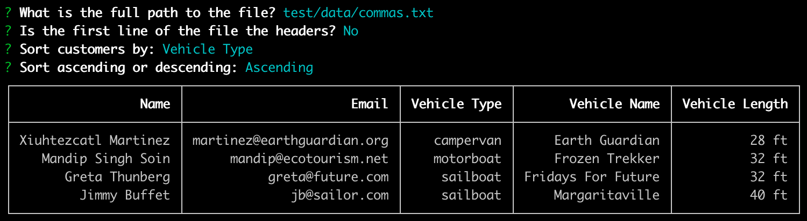

# Outdoor.sy CLI Tool

A simple interactive command-line tool for sorting and displaying a table of
customer data.



_Completed as a code project for The Wanderlust Group interview process._


## Installation

### 1. Install Node.js v16

If you have homebrew, you can run the following command to install Node.js v16:
```
brew install node@16
```

You could also download and run the v16 installer package from [https://nodejs.org/en/](https://nodejs.org/en/).

### 2. Install Dependencies

From the root directory of the project, run the following command:
```
npm install
```


## Running The Program

After running the installation instructions, the program can be run with
following command:
```
npm start
```

You will be asked a series of questions:
`**What is the full path to the file?**`
  Enter the full path to the file that contains the customer data you would
  like to view. There are several test data files located in `test/data/` that
  can be used to test the output of the CLI tool. For example, you could type
  `./test/data/commas.txt` and hit enter.
`**Is the first line of the file the headers?**`
  If your data file contains named headers as the first line of the file,
  then type `y` and hit enter. If your data file does not contain headers, then
  type `n` and hit enter.
`**Sort customers by:**`
  Use the up/down arrow keys to select the data column that you would like
  the data to be sorted by.
`**Sort ascending or descending:**`
  Use the up/down arrow keys to select whether the data should be sorted
  ascending or descending by the column you chose in the previous question.


## Build

To build the program without running it, run the following command:
```
npm build
```

This command will transpile the TypeScript files in the `src/` directory and
create the resulting JavaScript files in a `dist/` directory.


## Testing

Tests are located in the `test/` directory. After running the installation
instructions, the full test suite can be run with the following command:
```
npm test
```


## About This Solution

## Overview

I attempted to break this problem down into classes that encapsulate the data
and behavior of their real-world couterparts. This resulted in three main
classes: `CustomerList`, `Customer`, and `Vehicle`.

Because the problem requirements were quite minimal and loose, I tried to
create a system that is extensible should future product requirements arise.
An example of this extensibility is the existence of the `Vehicle` class. With
the current product requirements, there is a one-to-one relationship between
customers and vehicles. Therefore the `Vehicle` class is not necessary, since
the vehicle data and behavior could be part of the `Customer` class. However,
in the real world there is not a strict one-to-one relationship between people
and associated vehicles. There is a many-to-many relationship, where a person
can be associated with many vehicles and a vehicle can be associated with many
people. By creating the `Vehicle` class, when/if the need arises to represent
this many-to-many relationship in the system then the code is already setup
to facilitate this change.

## Assumptions

Some assumptions I made to arrive at this completed solution:
- Data files will not contain a mix of different delimiters.
- Data files will not be so large as to not fit in memory.
- After printing the customer list, users will likely not need to continue
sorting and interacting with the data -- the program exits right after printing
the customer data.
- Customer name follows the Western format of "<first name> <last name>".

## Additional Features

Some additional features implemented that are not outlined in the project
requirements:
- Support for meters as a unit of vehicle length, including "m", "meter", and
"meters" as unit markings.
- Ability to sort the data by all visible columns, as well as both ascending
and descending. (Note: Units of measurement are not taken into consideration
when sorting by vehicle length. The data is sorted based on the length
quantities. For example, a 12ft vehicle is considered smaller than a 13in
vehicle.)
- Ability to include named headers as the first line in the input file.
- Normalization of the vehicle length format:
"<quantity> <standard unit abbreviation>"
- Supports integer and float vehicle lengths.

### Technologies

This solution is written in TypeScript and Node.js. The applications runs as
an interactive command-line tool with the help of the third-party library
[inquirer](https://github.com/SBoudrias/Inquirer.js). The customer list output
is printed to the console in a table format with the help of the third-party
library
[console-table-printer](https://github.com/ayonious/console-table-printer). The
tests are written using the [mocha](https://mochajs.org/),
[chai](https://www.chaijs.com/), and [sinon](https://sinonjs.org/) test
framework libraries, as well as
[ts-node](https://github.com/TypeStrong/ts-node) for transpiling the TypeScript
test files into JavaScript.
